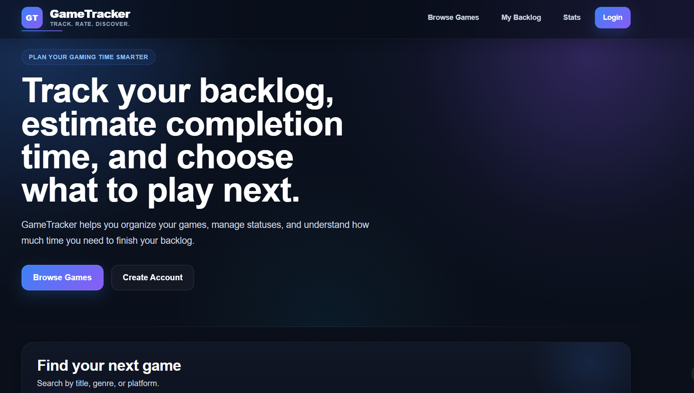
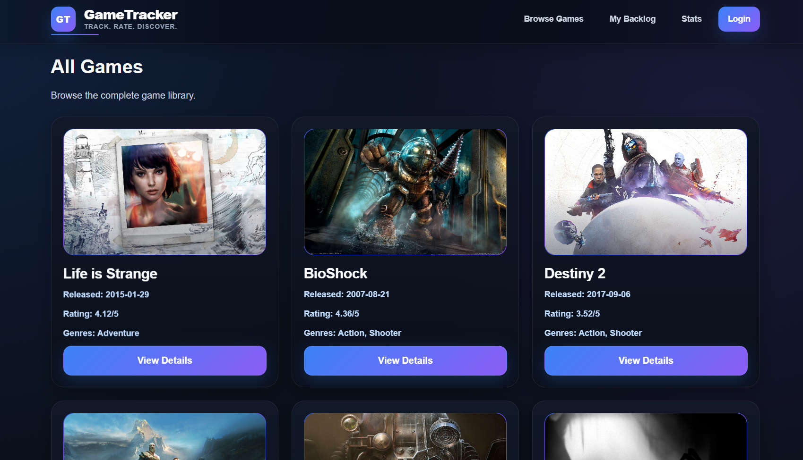

# 🎮 GameTracker

GameTracker is a custom WordPress theme built as a gaming backlog and discovery web application. The project combines WordPress theme development with a custom game post type, RAWG API integration, cached external data, custom templates, and a modern dark gaming UI.

The main goal of the project is to practice building a real WordPress-based application without relying on ready-made page builders or heavy plugins. It focuses on custom PHP, WordPress hooks, template files, API handling, data sanitization, escaping, and performance-aware development.

---

## 📸 Screenshots

### Homepage



### All Games page



---

## 🚀 Current Features

- Custom WordPress theme structure
- Custom post type: `game`
- Custom meta fields for game completion times:
  - Main Story hours
  - Completionist hours
- Homepage section with locally managed WordPress game posts
- Single game template for individual `game` posts
- External game catalog fetched from the RAWG API
- All Games page template with API-based game cards
- API pagination using WordPress `paginate_links()`
- RAWG game data displayed with:
  - title
  - background image
  - release date
  - rating
  - genres
  - external RAWG details link
- Placeholder image fallback for games without an image
- API response caching with WordPress Transients
- Separate cache keys based on API query arguments
- Fallback to the last successful API response when the API request fails
- Responsive dark UI styled with custom CSS
- WordPress-safe output escaping with functions such as `esc_html()`, `esc_url()`, and `esc_attr()`

---

## 🧠 What This Project Demonstrates

This project was created to show practical WordPress development skills beyond basic theme editing.

It demonstrates:

- WordPress theme development from custom files
- Working with WordPress hooks and actions
- Registering a Custom Post Type
- Creating and saving custom meta boxes
- Building custom page templates
- Building custom single post templates
- Using `WP_Query` for custom content loops
- Integrating an external REST API in WordPress
- Handling API errors safely
- Caching external API responses for better performance
- Separating dynamic API content from local WordPress content
- Writing safer PHP output with escaping functions
- Structuring a portfolio project around real application features

---

## 🛠️ Technologies Used

- WordPress
- PHP
- HTML5
- CSS3
- JavaScript
- RAWG Video Games Database API
- WordPress Transients API
- WordPress Custom Post Types
- WordPress Meta Boxes
- WordPress Template System

---

## 📁 Project Structure

```text
 gametracker-theme/
 ├── assets/
 │   ├── css/
 │   │   └── main.css
 │   ├── images/
 │   │   └── placeholder.jpg
 │   ├── js/
 │   │   └── main.js
 │   └── screenshots/
 │       ├── all_games_page.png
 │       └── home_page.png
 ├── inc/
 │   └── .gitkeep
 ├── template-parts/
 │   └── .gitkeep
 ├── footer.php
 ├── functions.php
 ├── header.php
 ├── index.php
 ├── page-all-games.php
 ├── single-game.php
 ├── style.css
 └── README.md
```

---

## 🔌 RAWG API Integration

The All Games page uses the RAWG API to fetch external game data.

The main API logic is handled in:

```text
functions.php
```

Main function:

```php
gametracker_get_rawg_games($page = 1, $page_size = 12, $search = '', $ordering = '', $genre = '')
```

The function is responsible for:

- validating pagination arguments
- preparing API query parameters
- generating a unique transient cache key
- checking cached data before making a request
- fetching games with `wp_remote_get()`
- checking for WordPress HTTP errors
- checking the HTTP response status code
- decoding the JSON response
- returning fallback data when the API request fails
- storing successful API responses in transients

---

## ⚡ Caching Strategy

GameTracker uses the WordPress Transients API to reduce unnecessary API calls and improve page performance.

Current caching behavior:

- page 1 is cached for 1 hour
- deeper paginated pages are cached for 10 minutes
- the last successful API response is stored for 1 day
- unique cache keys are generated from query arguments using `md5(json_encode(...))`

This approach makes the external game catalog more stable and reduces the risk of the page breaking when the API is temporarily unavailable.

---

## 🧩 WordPress Features

### Custom Post Type

The project registers a custom post type:

```php
register_post_type('game', ...)
```

The `game` post type supports:

- title
- editor
- featured image

### Custom Meta Boxes

The project adds custom fields for game completion times:

- Main Story Hours
- Completionist Hours

These values are saved as post meta and displayed on the single game page.

### Custom Templates

The project includes custom templates for:

- homepage layout
- All Games page
- single game page

---

## 🖥️ Pages

### Homepage

The homepage introduces the project and displays selected local WordPress `game` posts using `WP_Query`.

### All Games Page

The All Games page fetches game data from the RAWG API and displays it in a responsive grid.

Each card can include:

- game image
- game title
- release date
- RAWG rating
- genres
- external details link

### Single Game Page

The single game page displays a locally created WordPress `game` post with:

- title
- featured image
- main story time
- completionist time
- post content

---

## 🔐 API Key Configuration

The RAWG API key should not be committed to the repository.

Recommended local setup:

```php
define('RAWG_API_KEY', 'your_rawg_api_key_here');
```

This constant should be placed in a local configuration file such as `wp-config.php` or another private file that is not committed to Git.

---

## 🧪 How to Run Locally

1. Install WordPress locally, for example with LocalWP, XAMPP, Laragon, or another local WordPress environment.
2. Copy the `gametracker-theme` folder into:

```text
wp-content/themes/
```

3. Activate the theme in the WordPress admin panel.
4. Add your RAWG API key as the `RAWG_API_KEY` constant.
5. Create a WordPress page named `All Games`.
6. Assign the `All Games Page` template to that page.
7. Refresh permalinks in WordPress:

```text
Settings → Permalinks → Save Changes
```

8. Add a few local `game` posts if you want to test the homepage and single game template.

---

## ✅ Current Project Status

The project is currently a functional portfolio-stage WordPress theme.

Implemented areas:

- custom theme layout
- custom game post type
- custom game meta fields
- RAWG API fetching
- API caching
- API pagination
- responsive game cards
- basic single game pages
- screenshot-ready UI

Not yet implemented as full production features:

- user accounts
- personal backlog system
- internal user rating system
- comments/reviews system
- dynamic frontend search form
- advanced filtering UI
- internal RAWG game detail pages

---

## 🔮 Planned Improvements

Future development ideas:

- user registration and login
- personal game backlog
- game status tracking, for example: planned, playing, completed, dropped
- user rating system
- user comments or short reviews
- dynamic search connected to the RAWG API
- filtering by genre, platform, rating, and release date
- internal game detail pages based on RAWG data
- better error messages for failed API requests
- loading states and empty states
- improved accessibility
- further code separation into files inside `/inc`
- nonce verification for custom meta box saving
- more advanced security checks for admin-side saving logic

---

## 🎯 Purpose

GameTracker was built as a practical portfolio project for learning and demonstrating WordPress development in a more application-like context.

The project is intended to show that WordPress can be used not only for simple websites, but also for custom data-driven interfaces that combine local content, external APIs, caching, custom templates, and structured PHP logic.


